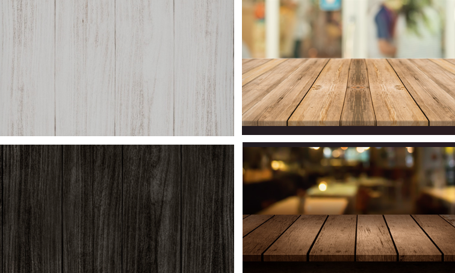
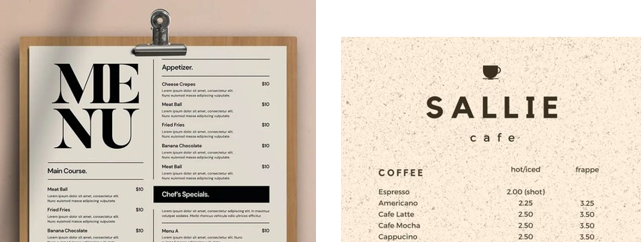

# Webapp menú de restaurante.
---

Se solicita una página principal, una página de detalle y una página de contacto para mostrar la idea a posibles inversores, y como es esperable, el emprendedor nos solicita que la aplicación se pueda navegar y que “no se rompa” ni quede en estados inconsistentes.

# Ideas y enfoque. 
---

Esta página es para un restaurante itailano llamado __"Nonno"__, debe ser una página sencilla, comoda de usar y que represente la esencia de la comida italiana de este restaurante. 

## Enfoque

Se dio un enfoque de utilizar _texturas_ y los _colores_ que nos hagan sentir que estamos visitando el restaurante de _dia o de noche_, mediante un icono de modo. 

>Este modo cambia imagen de fondo entre una madera oscura o una madera clara, como también cambia color del texto de la página y color del logo/nombre empresa. 

>El menú de detalles se pensó seguir la idea de la madera y utilizar un fondo similar a un anotador de madera y poder ver los menús en hojas. 

Resultado de esta idea:

Ejemplos:

